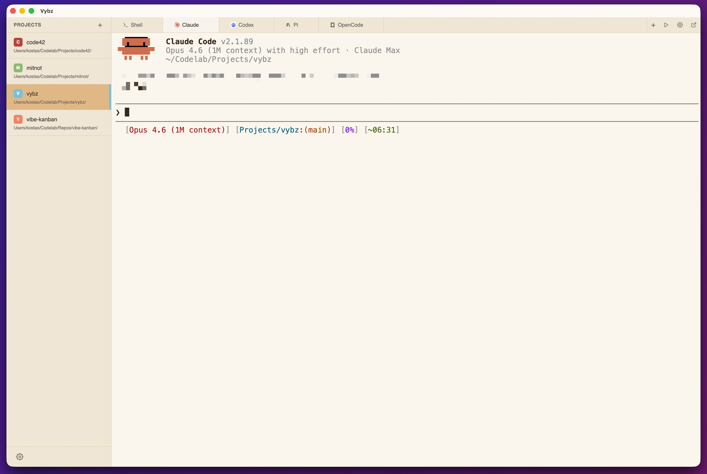
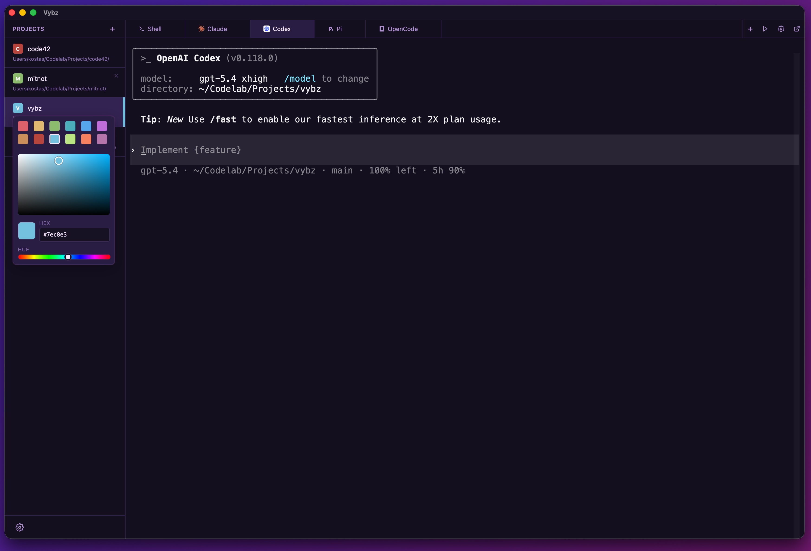
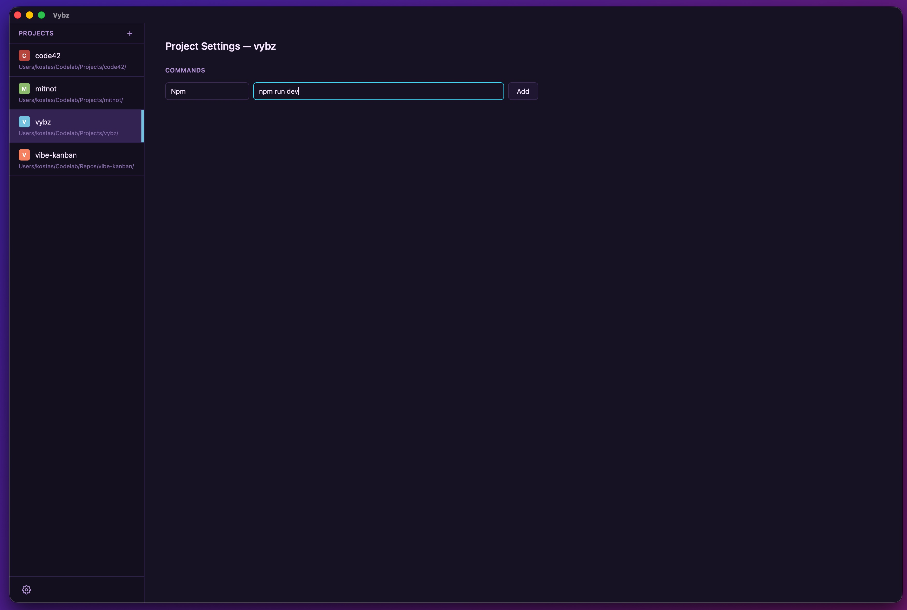
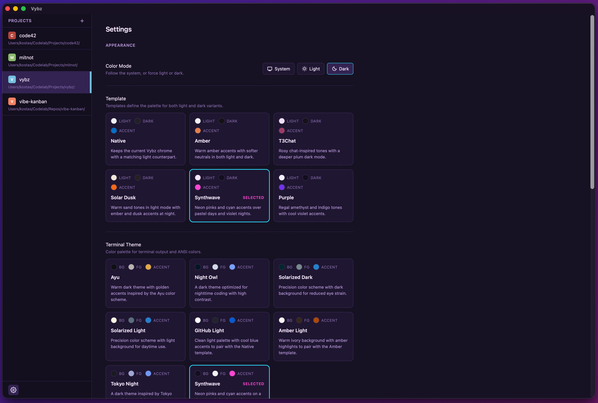
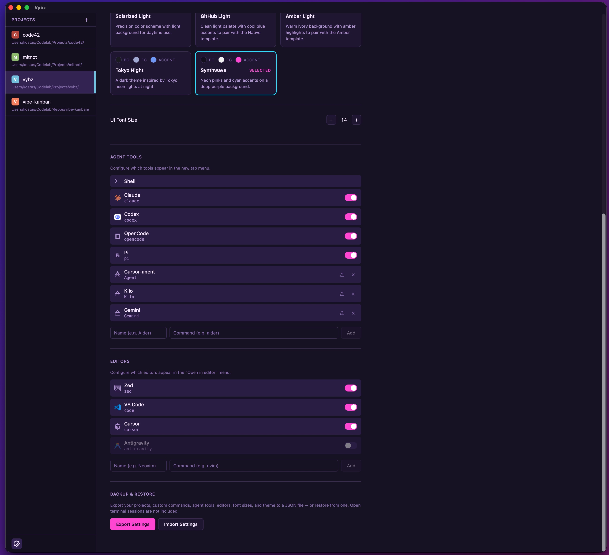
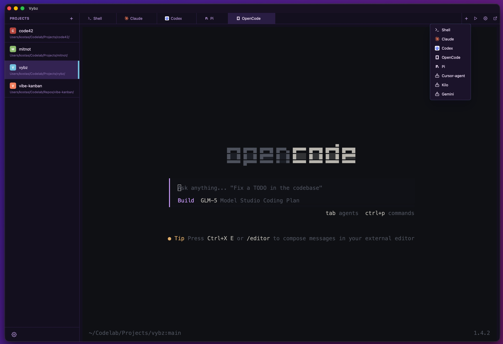

# Vybz

Vybz is a Tauri desktop app for managing multiple project terminal sessions. Each project gets a color-coded sidebar entry and tabbed terminals that can run shells or AI coding tools.

## Screenshots









---
## Stack

- Tauri v2
- React 19
- TypeScript
- Rust

## Development

```bash
pnpm install
pnpm tauri dev
```

Frontend only:

```bash
pnpm dev
```

Production build:

```bash
pnpm build
pnpm tauri build
```

## Notes

- Frontend state lives in `src/`
- Tauri backend lives in `src-tauri/`
- Theme system reference: `docs/refs/theme-module.md`
